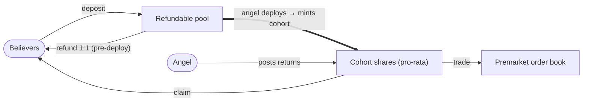
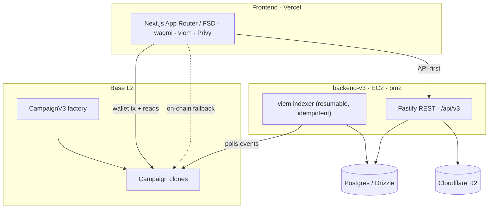

<!--
  Placeholders marked 🖼️ (image) / 🎥 (video) need real assets captured from the app.
  Everything else is ready. Replace each blockquote placeholder with the asset, then delete its note.
-->

<div align="center">

<!-- 🖼️ Optional: a logo/banner (the app favicon lives at frontend/src/app/icon.svg — an arch/"A" monogram). -->

# Arkenia

**Onchain fundraising with a fully refundable pool.**
Back angel campaigns in USDC — deposits stay refundable until deployed, deployed capital becomes **cohort shares**, and you claim returns or trade them on a **premarket**.

[](https://github.com/vladkvlchk/arkenia/actions/workflows/ci.yml)


[**Live (mainnet)**](https://arkenia.xyz) · [**Try on testnet**](https://testnet.arkenia.xyz) · [Contracts](#-deployed-contracts) · [Architecture](#-architecture)

</div>

> 🖼️ **Hero shot needed** — _a wide screenshot or short GIF of the campaign explorer / a campaign detail page. This is the first thing a reviewer sees; make it count._

---

## What is Arkenia?

Arkenia is a full-stack Web3 product that rethinks crowdfunding around a **trust-minimised, refundable pool**:

1. **Believers deposit** USDC into a campaign's shared pool. While capital is idle it is **refundable 1:1** — the campaign never custodies un-deployed funds.
2. When the **angel deploys** pooled capital to do real work, that deployment **mints a cohort**: depositors receive pro-rata **shares** in it.
3. As the angel **posts returns**, the contract distributes them across cohorts automatically.
4. Believers **claim** their returns — or **trade cohort shares** on an off-chain, on-chain-settled **premarket** order book before returns land.

The result is a fundraising primitive where backers keep optionality (refund early, or hold a claim on upside) and the operator can only ever touch capital they've openly deployed.

> 🖼️ **Screenshot needed** — _campaign detail page: pool total, cohorts, and the deposit/refund panel._

---

## ✨ Highlights

Things in here worth a closer look if you're reviewing the engineering:

- **A novel on-chain mechanism, fully implemented** — refundable pool → pro-rata **cohort shares** with lazy-settlement reward accounting (bigint + RAY fixed-point) → distributed returns → a secondary premarket.
- **A bit-exact indexer** — the backend **replays the contract's settlement math** so every API value matches on-chain reads to the wei; verified against a live network (down to floored dust).
- **Gasless, custody-free off-chain writes** — campaign metadata and premarket orders are authenticated by **EIP-191 / EIP-712 signatures**, verified server-side (`recover(sig) == author`, angel-gated where needed). No gas, no accounts, no keys.
- **API-first with an on-chain fallback** — the UI renders from the indexer, but degrades to **direct chain reads** when the backend is unavailable, so the core app never hard-fails.
- **One codebase, two contours (12-factor)** — mainnet and testnet are the *same build* selected purely by env; `NEXT_PUBLIC_CHAIN_ID` flips the token, explorer, faucet, and disclosure across the whole app.
- **A restrained design system** — monochrome, editorial: semantic HSL tokens, light/dark, depth from hairlines + tonal steps (never shadows), a three-typeface hierarchy.
- **Green-CI merge gate** — three parallel jobs (Hardhat, `next build`, hermetic PGlite backend tests) gate every merge to `main`.

---

## 🔗 Live demo & deployed contracts

| | Chain | App | Token |
|---|---|---|---|
| **Mainnet** | Base (`8453`) | [arkenia.xyz](https://arkenia.xyz) ⚠️ real USDC | USDC |
| **Testnet** | Base Sepolia (`84532`) | [testnet.arkenia.xyz](https://testnet.arkenia.xyz) — free, faucet | TestUSDC |

> 💡 New here? Use **testnet** — connect a wallet, grab faucet USDC in-app, and create/back a campaign end-to-end with no real funds.

### Deployed contracts

**Base mainnet**
- Factory — [`0x20D5…2652`](https://basescan.org/address/0x20D5728912f834aD868850cdf6678C1B32692652)
- Campaign impl — [`0x594a…7a5F`](https://basescan.org/address/0x594aD41277A105c329c953C4E2101eA0ba5a7a5F)
- USDC — [`0x8335…2913`](https://basescan.org/address/0x833589fCD6eDb6E08f4c7C32D4f71b54bdA02913)

**Base Sepolia**
- Factory — [`0x3Ee5…9750`](https://sepolia.basescan.org/address/0x3Ee587e2033149d7Dc2793daaE5af292BBe49750)
- TestUSDC (faucet) — [`0xe112…E79C`](https://sepolia.basescan.org/address/0xe1124725E81B3af7A06Ca823af5eF3958DaBE79C)

---

## 📸 Screenshots

> 🖼️ **Add 3–4 shots** (or a single GIF walkthrough). Suggested set, each ~1 line caption:
> - Campaign explorer / grid
> - Campaign detail (pool, cohorts, deposit)
> - Premarket order book
> - Portfolio / positions

| Explorer | Campaign detail |
|---|---|
| 🖼️ _explorer.png_ | 🖼️ _campaign.png_ |
| **Premarket** | **Portfolio** |
| 🖼️ _premarket.png_ | 🖼️ _portfolio.png_ |

> 🎥 _Optional but strong: a 30–60s demo video (Loom/YouTube) linked here._

---

## 🔄 How it works



- **Deposit / Refund** — deposits sit in a `poolTotal` that is refundable 1:1 until deployed.
- **Deploy** — the angel withdraws pooled capital to deploy it; this mints a **cohort** and distributes shares pro-rata to that pool's depositors.
- **Return / Claim** — the angel posts returns; the contract accrues them per cohort (lazy settlement); believers claim.
- **Premarket** — cohort shares can be bought/sold via signed **EIP-712 orders** matched off-chain and settled on-chain.

---

## 🏗 Architecture



Three independently-deployable pieces, wired by contract addresses and a shared REST contract:

- **`contracts/`** — `CampaignV3` (Solidity 0.8.24, OpenZeppelin, Hardhat). A factory clones campaigns; 2-step ownership; token whitelist.
- **`frontend/`** — Next.js App Router in **Feature-Sliced Design**. Wallet via Privy + wagmi/viem; server state via TanStack Query; a token-driven design system in Tailwind.
- **`backend-v3/`** — **Clean Architecture** (domain / application / infrastructure / presentation): a viem **indexer** projects on-chain events into Postgres (Drizzle), a **Fastify** API serves campaigns, activity, positions, premarket, and angel-signed metadata; covers on R2.

Both contours (mainnet + testnet) run from **one build**, selected by env (chain id, factory address, RPC, API URL, Privy app).

> 🖼️ _Optional: replace the diagrams above with a designed architecture graphic if you make one._

---

## 🧰 Tech stack

| Layer | Tech |
|---|---|
| **Contracts** | Solidity 0.8.24 · Hardhat · OpenZeppelin 5 · TypeChain · ethers v6 |
| **Frontend** | Next.js 14 · React 18 · TypeScript · Tailwind · wagmi 2 / viem 2 / Privy · TanStack Query · Radix UI · FSD |
| **Backend** | Node 20 · Fastify · Drizzle ORM · PostgreSQL · viem · Zod · Pino · Clean Architecture |
| **Chain** | Base (mainnet + Sepolia) · USDC |
| **Infra** | Vercel · AWS EC2 (pm2) · Cloudflare R2 · nginx · GitHub Actions CI |

---

## 📁 Repository layout

```
.
├── contracts/     # CampaignV3 (Solidity) · Hardhat · deploy scripts
├── frontend/      # Next.js App Router · Feature-Sliced Design
├── backend-v3/    # Fastify API + viem indexer · Drizzle/Postgres (standalone package)
├── deploy/        # nginx reverse-proxy templates
└── .github/       # CI (contracts · frontend · backend)
```

> Note: root npm **workspaces** cover `contracts` + `frontend`; `backend-v3` is a standalone package with its own lockfile.

---

## 🚀 Local development

<details>
<summary><b>Prerequisites</b></summary>

- Node ≥ 20, npm
- PostgreSQL (local) for the backend
- A WalletConnect/Privy app id and a Base Sepolia RPC (public `https://sepolia.base.org` works)
</details>

```bash
# 1) Contracts — compile + test
npm ci
npm run --workspace contracts compile
npm run --workspace contracts test

# 2) Backend (standalone) — indexer + API against Base Sepolia
cd backend-v3
npm ci
createdb arkenia_v3
cp .env.example .env            # set DATABASE_URL + Sepolia FACTORY_ADDRESS/RPC
npm run migrate
npm run dev:indexer             # projects on-chain events → Postgres
npm run dev:api                 # REST API (see PORT in .env)

# 3) Frontend
cd ../frontend
# create .env.local with NEXT_PUBLIC_* (chain id, factory, API url, Privy app id)
npm run dev                     # http://localhost:3000
```

The frontend is **API-first with an on-chain fallback**: list/detail still render from chain reads with the backend down; activity, positions and premarket need the indexer.

---

## ✅ CI

Every push and PR runs three parallel jobs; green CI is the merge gate into `main`:

- **contracts** — `hardhat compile` + `hardhat test` (in-process network).
- **frontend** — `next build` (type-check + lint).
- **backend-v3** — `tsc` build + `vitest` on an in-process **PGlite** database (no Postgres, no network).

---

## 🔒 Security & status

CampaignV3 handles real USDC and passed a **rigorous internal adversarial audit** (all code findings fixed) but is **not externally audited**. The mainnet app carries an explicit "unaudited" disclosure. Trust model: _angel-trusted-with-deployed-capital_ — believers' un-deployed funds are always refundable and never custodied. Use accordingly.

---

## 🗺 Roadmap

Active, tracked in [Issues](https://github.com/vladkvlchk/arkenia/issues):

- [#1](https://github.com/vladkvlchk/arkenia/issues/1) — Integrate **x402** (HTTP-402) pay-per-call USDC access to an API endpoint
- [#2](https://github.com/vladkvlchk/arkenia/issues/2) — **Sankey flow visualization** (deposited → deployed/refunded → returned)
- [#3](https://github.com/vladkvlchk/arkenia/issues/3) — Per-campaign **community feed** (posts, comments, angel announcements + moderation)

---

## 📄 License

Released under the [MIT License](LICENSE).

The contracts are **unaudited** and deployed to Base Sepolia for demonstration only. The licence
grants permission to use the code; it is not a warranty that the code is safe to hold value.

---

<div align="center">
<sub>Built by <a href="https://github.com/vladkvlchk">@vladkvlchk</a> · Base · USDC</sub>
</div>
